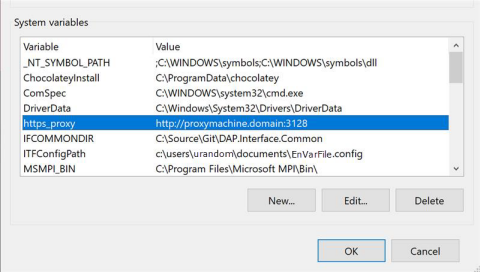
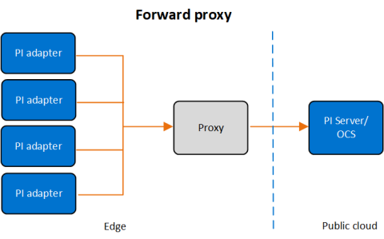
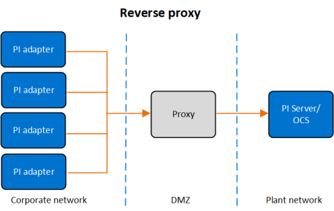

# Configure a network proxy

Some network architectures may need a network proxy between the PI adapter and the egress endpoint. The process for configuring the adapter to egress data through a network proxy varies depending on the proxy type.

## HTTPS forward proxy

For the adapter to use an HTTPS forward proxy while egressing, configure the `https_proxy` environment variable. For information on how to configure system environment variables, refer to your platform specific documentation:

* Windows: [setx](https://docs.microsoft.com/en-us/windows-server/administration/windows-commands/setx)
* Ubuntu: [EnvironmentVariables](https://help.ubuntu.com/community/EnvironmentVariables)
* Debian: [EnvironmentVariables](https://wiki.debian.org/EnvironmentVariables)
* Docker: [Environment variables in Compose](https://docs.docker.com/compose/environment-variables/)

The value of this environment variable must contain the URL of the proxy server, beginning with `http`. The format of the string is `[user[:password]@]http://hostname[:port]`.

### HTTPS proxy environment variable

Parameter| Required | Description
---------|----------|---------
 `user` | Optional| The user name for the HTTPS forward proxy.
 `password` | Optional | The password for the HTTPS forward proxy specified user name. If you specify `user`, `password` remains optional.
 `port` | Optional | If you do not specify `port`, the default `80` is used.

**Note:** Usage of the `https_proxy` environment variable may affect other .NET or .NET Core applications. If you set this environment variable, it will affect the adapter egress endpoints and the adapter health endpoints.

**Examples:**

```json
myUser@http://192.168.2.2
```
```json
myUser:myPassword@http://proxymachine.domain:3128
```

```json
http://proxymachine.domain
```

In Windows, this may look something like:



Example of an architecture with an https forward proxy:



## Reverse proxy

For the adapter to use a reverse proxy while egressing, you must configure the reverse proxy as an egress endpoint. For information on how to configure an egress endpoint, see [Egress endpoints configuration](xref:EgressEndpointsConfiguration1-3).

**Example:**

```json
[{
     "Id": "PI Web API Through Proxy",
     "Endpoint": "https://<reverseProxy>:<port>/piwebapi/omf/",
     "UserName": "<piWebApiUser>",
     "Password": "<piWebApiPassword>"
}]
```

Example of an architecture with a reverse proxy:


